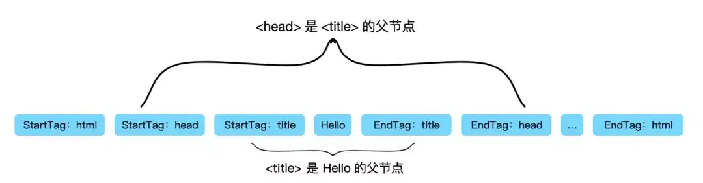
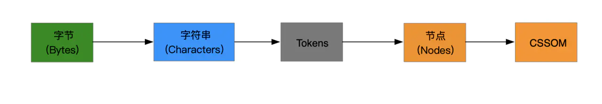

## 前言

浏览器是我们日常开发的重要的工具，那么你了解浏览器吗？即使在前端面试中，我们也经常会遇到：在浏览器地址中从输入 url 地址到出现页面，这个过程发生了什么？介绍一下重绘和回流？这一类关于浏览器的问题。我们可能会知道大概的轮廓但对于具体的细节却是不那么清楚，那么今天我们就从浏览器组成开始来了解一下浏览器的渲染机制

## 浏览器组成

浏览器主要由 7 个部分组成：

- 用户界面（User Interface）：定义了一些常用的浏览器组件，比如地址栏，返回、书签等等
- 数据持久化（Data Persistence）：指浏览器的 cookie、local storage 等组件
- 浏览器引擎（Browser engine）：平台应用的相关接口，在用户界面和呈现引擎之间传送指令。
- 渲染引擎（Rendering engine）：处理 HTML、CSS 的解析与渲染
- JavaScript 解释器（JavaScript Interpreter）：解析和执行 JavaScript 代码
- 用户界面后端（UI Backend）：指浏览器的的图形库等
- 网络（Networking）：用于网络调用，比如 HTTP 请求

## 浏览器内核

浏览器内核分为两部分：渲染引擎(layout engineer 或 Rendering Engine)和 JS 引擎

- 渲染引擎：负责取得网页的内容（HTML、XML、图像等等）、整理讯息（例如加入 CSS 等），以及计算网页的显示方式，然后会输出至显示器或打印机
- JS 引擎：负责解析和执行 javascript 来实现网页的动态效果
  浏览器的内核的不同对于网页的语法解释会有不同，所以渲染的效果也不相同。所有网页浏览器、电子邮件客户端以及其它需要编辑、显示网络内容的应用程序都需要内核，最开始渲染引擎和 JS 引擎并没有区分的很明确，后来 JS 引擎越来越独立，内核就倾向于只指渲染引擎

<Alert>常见的浏览器内核：Trident（IE）、Gecko（火狐）、Blink（Chrome、Opera）、Webkit（Safari）</Alert>

## 页面加载流程

在了解浏览器渲染过程之前，先来了解一下页面的加载流程。有助于更好理解后续渲染过程。从浏览器地址中从输入 url 地址到渲染出一个页面，会经过以下过程。

1. 浏览器输入的 `url` 地址经过 DNS 解析获得对应的 IP
2. 向服务器发起 `TCP` 的 3 次握手
3. 建立链接后，浏览器向该 IP 地址发送 `http` 请求
4. 服务器接收到请求，返回一堆 `HMTL` 格式的字符串代码
5. 浏览器获得 `html` 代码，解析成 `DOM` 树
6. 获取 `CSS` 并构建 `CSSOM`
7. 将 `DOM` 与 `CSSOM` 结合，创建渲染树
8. 找到所有内容都处于网页的哪个位置，布局渲染树
9. 最终绘制出页面

## 浏览器渲染机制

我们将要介绍的浏览器渲染过程主要步骤是 5-9 步，可以用下面的图来形象的展示

### 解析 HTML 成 DOM 树

这个解析过程大概可以分为几个步骤：

- 第一步：浏览器从磁盘或网络读取 `HTML` 的原始字节，也就是传输的 0 和 1 这样的字节数据，并根据文件的指定编码（例如 UTF-8）将它们转换成字符串。
- 第二步：将字符串转换成 `Token`,例如：“”、“”等。`Token` 中会标识出当前 `Token` 是“开始标签”或是“结束标签”亦或是“文本”等信息
- 第三步：在每个 `Token` 被生成后，会立刻消耗这个 `Token` 创建出节点对象，因此在构建 DOM 的过程中，不是等待所有的 `Token` 都生成后才去构建 `DOM`,而是一边生成 `Token` 一边消耗来生成节点对象。

<Alert>
注意：带有结束标签标识的 `Token` 不会创建节点对象 第四步：通过“开始标签”与“结束标签”来识别并关联节点之间的关系。当所有 Token 都生成并消耗完毕后，我们就得到了一颗完整的 `DOM` 树。
</Alert>

但是现在有一个疑问，节点之间的关联关系是如何维护的呢？

上面我们提到 `Token` 会标识是“开始标签”还是“结束标签”，以下图为例：“Hello” `Token` 位于“title”开始标签与“title”结束标签之间，表明“Hello” `Token` 是“title” `Token` 的子节点。同理“title” `Token` 是“head” `Token` 的子节点。

### 构建 CSSOM

既然有了 html 解析，那 css 解析也是必不可少的，解析 css 构建 `CSSOM` 的过程和构建 DOM 的过程非常的相似。当浏览器接收到一段 CSS，浏览器首先要做的是识别出 `Token`，然后构建节点并生成 `CSSOM`

节点中样式可以通过继承得到，也可以自己设置，因此在构建的过程中浏览器得递归 `CSSOM` 树，然后确定具体的元素到底是什么样式。为了 `CSSOM` 的完整性，也只有等构建完毕才能进入到下一个阶段，哪怕 `DOM` 已经构建完，它也得等 `CSSOM`，然后才能进入下一个阶段。

<Alert>
CSS 匹配 HTML 元素是一个相当复杂和有性能问题的事情。所以，DOM 树要小，CSS 尽量用 id 和 class，千万不要过渡层叠下去 所以，CSS 的加载速度与构建 CSSOM 的速度将直接影响首屏渲染速度，因此在默认情况下CSS被视为阻塞渲染的资源
</Alert>

### 构建渲染树

当我们生成 `DOM` 树和 `CSSOM` 树后，我们需要将这两颗树合并成渲染树，在构建渲染树的过程中浏览器需要做如下工作：

- 从 DOM 树的根节点开始遍历每个可见节点。
- 有些节点不可见（例如`脚本 Token`、`元 Token` 等），因为它们不会体现在渲染输出中，所以会被忽略。
- 某些节点被 `CSS` 隐藏，因此在渲染树中也会被忽略。例如某些节点设置了 `display: none` 属性。
- 对于每个可见节点，为其找到适配的 `CSSOM` 规则并应用它们

### 渲染阻塞

在渲染的过程中，遇到一个 `script` 标记时，就会停止渲染，去请求脚本文件并执行脚本文件，因为浏览器渲染和 `JS` 执行共用一个线程，而且这里必须是单线程操作，多线程会产生渲染 `DOM` 冲突。`JavaScript` 的加载、解析与执行会严重阻塞 `DOM` 的构建。只有等到脚本文件执行完毕，才会去继续构建 DOM。

js 不单会阻塞 `DOM` 构建，还会导致 `CSSOM` 也阻塞 `DOM` 的构建，如果 `JavaScript` 脚本还操作了 `CSSOM`，而正好这个 `CSSOM` 还没有下载和构建，浏览器甚至会延迟脚本执行和构建 `DOM`，直至完成其 `CSSOM` 的下载和构建，然后再执行 `JavaScript`，最后在继续构建 DOM

因此 `script` 的位置很重要，在实际使用过程中遵循以下两个原则：

- `CSS` 优先：引入顺序上，`CSS` 资源先于 `JavaScript` 资源。
- `JS` 置后：我们通常把 `JS` 代码放到页面底部，且 `JavaScript` 应尽量少影响 `DOM` 的构建

### 布局与绘制

浏览器拿到渲染树后，就会从渲染树的根节点开始遍历，然后确定每个节点对象在页面上的确切大小与位置，通常这一行为也被称为“自动重排”。布局阶段的输出是一个盒子模型，它会精确地捕获每个元素在屏幕内的确切位置与大小，所有相对测量值都将转换为屏幕上的绝对像素。这一过程也可称为回流
布局完成后，浏览器会立即发出“Paint Setup”和“Paint”事件，将渲染树转换成屏幕上的像素。

## 性能优化策略

在我们了解浏览器的渲染机制后，`DOM` 和 `CSSOM` 结构构建顺序，我们可以针对性能优化问题给出一些方案，提升页面性能。

### 回流(`reflow`)与重绘(`repaint`)

当元素的样式发生变化时，浏览器需要触发更新，重新绘制元素。这个过程中，有两种类型的操作，即重绘与回流。

- 重绘(`repaint`): 当元素样式的改变不影响布局时，浏览器将使用重绘对元素进行更新，此时由于只需要 UI 层面的重新像素绘制，因此损耗较少
- 回流(`reflow`): 当元素的尺寸、结构或触发某些属性时，浏览器会重新渲染页面，称为回流。此时，浏览器需要重新经过计算，计算后还需要重新页面布局，因此是较重的操作。会触发回流的操作:
- 添加或删除可见的 `DOM` 元素
- 元素的位置发生变化
- 元素的尺寸发生变化（包括外边距、内边框、边框大小、高度和宽度等）
- 内容发生变化，比如文本变化或图片被另一个不同尺寸的图片所替代。
- 页面一开始渲染的时候（这肯定避免不了）
- 浏览器的窗口尺寸变化（因为回流是根据视口的大小来计算元素的位置和大小的

<Alert>注意：回流一定会触发重绘，而重绘不一定会回流,重绘的开销较小，回流的代价较高</Alert>

因此为了减少性能优化，我们可以尽量避免回流或者重绘操作 css

- 避免使用 `table` 布局
- 将动画效果应用到 `position` 属性为 `absolute` 或 `fixed` 的元素上

javascript

- 避免频繁操作样式，可汇总后统一 一次修改
- 尽量使用 `class` 进行样式修改
- 减少 `dom` 的增删次数，可使用 字符串 或者 `documentFragment` 一次性插入
- 极限优化时，修改样式可将其 `display: none` 后修改
- 避免多次触发上面提到的那些会触发回流的方法，可以的话尽量用 变量存储

`async` 和 `defer` 的作用是什么？有什么区别?

其中蓝色线代表 JavaScript 加载；红色线代表 JavaScript 执行；绿色线代表 HTML 解析

1）情况 1 `<scriptsrc="script.js">` 没有 `defer` 或 `async`，浏览器会立即加载并执行指定的脚本，也就是说不等待后续载入的文档元素，读到就加载并执行。
2）情况 2 (异步下载) `async` 属性表示异步执行引入的 `JavaScript`，与 `defer` 的区别在于，如果已经加载好，就会开始执行——无论此刻是 `HTML` 解析阶段还是 `DOMContentLoaded` 触发之后。需要注意的是，这种方式加载的 `JavaScript` 依然会阻塞 `load` 事件。换句话说，`async-script` 可能在 `DOMContentLoaded` 触发之前或之后执行，但一定在 `load` 触发之前执行。
3）情况 3 `<scriptdefersrc="script.js">`(延迟执行) `defer` 属性表示延迟执行引入的 `JavaScript`，即这段 `JavaScript` 加载时 `HTML` 并未停止解析，这两个过程是并行的。整个 `document` 解析完毕且 `defer-script` 也加载完成之后（这两件事情的顺序无关），会执行所有由 `defer-script` 加载的 `JavaScript` 代码，然后触发 `DOMContentLoaded` 事件。

`defer` 与相比普通 `script`，有两点区别：

- 载入 `JavaScript` 文件时不阻塞 `HTML` 的解析，执行阶段被放到 `HTML` 标签解析完成之后；
- 在加载多个 `JS` 脚本的时候，`async` 是无顺序的加载，而 `defer` 是有顺序的加载

`js` 优化可以在 `script` 标签加上 `defer` 属性 和 `async` 属性用于在不阻塞页面文档解析的前提下，控制脚本的下载和执行

<Alert>其他: CSS 标签的 rel 属性 中的属性值设置为 preload 能够让你在你的 HTML 页面中可以指明哪些资源是在页面加载完成后即刻需要的,最优的配置加载顺序，提高渲染性能</Alert>

### 首屏优化加载

- 减少首屏 `CGI` 的计算量：比如在微信 8.8 无现金日 H5 开发中，前端希望拿到用户的个人信息、消费记录、排名三类数据，如果只通过一个 `CGI` 来处理，那么后台响应时间肯定会变长；由于在 `H5` 的首屏中，只包含了用户信息，消费记录、排名都在第 2 屏和第 3 屏，此时其实可以利用异步的方式来拿消费记录、排名的数据。
- 页面瘦身：压缩 `HTML`、`CSS`、`JavaScript`。
- 多用缓存：缓存能大幅度降低页面非首次加载的时间。
- （少用） `table` 布局，浏览器在渲染 `table` 时会消耗较多资源，而且只有 `table` 里有一点变化，整个 `table` 都会重新渲染。
- 做预加载：部分 `H5` 页面首屏可能要下载较多的静态资源，比如图片，这时为了避免加载时出现“难看”的页面，用预加载（loading 的方式）做一个过渡。
- cdn 分发（减少传输距离）。通过在多台服务器部署相同的副本，当用户访问时，服务器根据用户跟哪台服务器距离近，来决定哪台服务器去响应这个请求。
- 前端的资源动态加载
  - 路由动态加载，最常用的做法，以页面为单位，进行动态加载。
  - 组件动态加载(offScreen Component)，对于不在当前视窗的组件，先不加载。
  - 图片懒加载(offScreen Image)，同上。值得庆幸的是，越来越多的浏览器支持原生的懒
    加载，通过给 `img` 标签加上 `loading="lazy"` 来开启懒加载模式。
- 减少请求：`CSS`、`JavaScript` 文件数尽量少，甚至当 `CSS`、`JS` 的代码不多时，可以考虑直接将代码内嵌到页面中。 这点在 http1.1 的优势很明显，因为 http1.1 的请求是串行的（尽管有多个 tcp 通道），每个请求都需要往返后才能继续下个请求。此时合并请求可以减少在路途上浪费的时间，此外还会带来重复的请求头部信息（比如 cookie)。在 http2.0 中这个问题会弱化很多，但也有做的必要。
- 页面使用骨架屏。意思是在首屏加载完成之前，通过渲染一些简单元素进行占位。骨架屏的好处在于可以减少用户等待时的急躁情绪。这点很有效，在很多成熟的网站（京东、淘宝、Youtube）都有大量应用。没有骨架屏的话，一个 loading 的菊花图也是可以的。
- 使用 ssr 渲染
- 引入 http2.0。http2.0 对比 http1.1，最主要的提升是传输性能，在接口小而多的时候会更加明显。
- 利用好 http 压缩。即使是最普通的 gzip，也能把 bootstrap.min.css 压缩到原来的 17%。可见，压缩的效果非常明显，特别是对于文本类的静态资源。另外，接口也是能压缩的。接口不大的话不用压缩，因为性价比低（考虑压缩和解压的时间）。
- 利用好 script 标签的 async 和 defer 这两个属性。功能独立且不要求马上执行的 js 文件，可以加入 async 属性。如果是优先级低且没有依赖的 js，可以加入 defer 属性。
- （少用）选择先进的图片格式。使用 WebP 的图片格式来代替现有的 jpeg 和 png，当页面图片较多时，这点作用非常明显。把部分大容量的图片从 BaseLine JPEG 切换成 Progressive JPEG（理解这两者的差别）也能缩小体积。
- （少用）渲染的优先级。浏览器有一套资源的加载优先级策略。也可以通过 js 来自己控制请求的顺序和渲染的顺序。一般我们不需要这么细粒度的控制，而且控制的代码也不好写。
- （少用）前端做一些接口缓存。前端也可以做接口缓存，缓存的位置有两个，一个是内存，即赋值给运行时的变量，另一个是 localStorage。比如用户的签到日历（展示用户是否签到），我们可以缓存这样的接口到 localStorage，有效期是当天。或者有个列表页，我们总是缓存上次的列表内容到本地，下次加载时，我们先从本地读取缓存，并同时发起请求到服务器获取最新列表。

## 总结

我们已经将浏览器的渲染机制了解了一遍，不仅了解到一些性能优化方案，也可以得出结论： 浏览器渲染的关键路径共分五个步骤：

<Alert>构建 DOM -> 构建 CSSOM -> 构建渲染树 -> 布局 -> 绘制</Alert>

参考链接：

- [Google 官方 | 渲染树构建、布局及绘制](https://developers.google.com/web/fundamentals/performance/critical-rendering-path/render-tree-construction?hl=zh-cn)
- [浏览器渲染原理及流程](https://juejin.cn/post/6844903923795361800)
- [从浏览器渲染原理，浅谈回流重绘与性能优化](https://juejin.cn/post/6844904119157669902)
- [你真的了解回流和重绘吗](https://juejin.cn/post/6844904063641862151)
- [如何减少浏览器 repaint 和 reflow ?](http://blog.csdn.net/liaozhongping/article/details/47057889)
